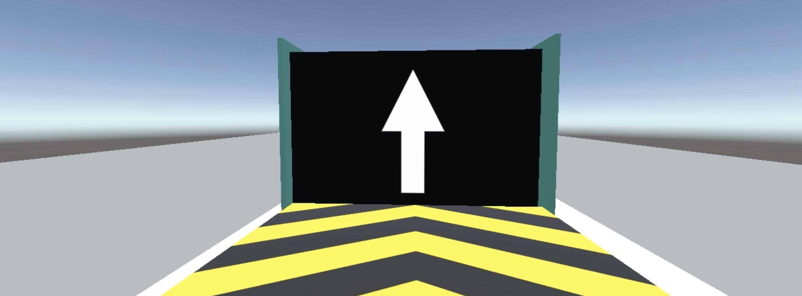
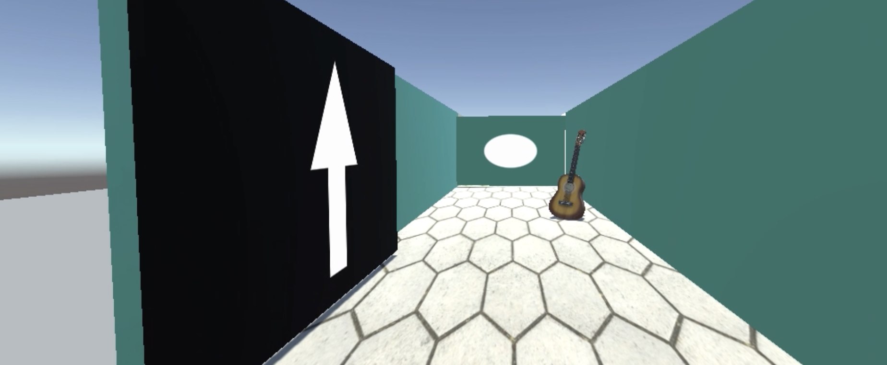
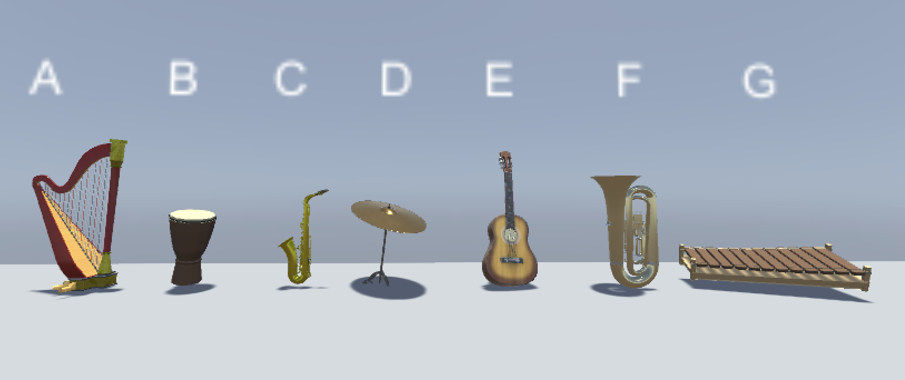

# Unity linear-maze EEG paradigm

Unity-based visuospatial audiovisual paradigm developed for EEG research, combining first-person linear-maze navigation with a post-task instrument recognition test.

  

## Overview

This repository contains a recovered and documented version of the original Unity project used to generate an audiovisual stimulus for an EEG experiment.

The original project was developed in 2021 using Unity 2020.3.4f1 and was recovered and tested in 2026 using Unity 2020.3.49f1.

Participants did not navigate the Unity environment directly. The maze was traversed manually while being recorded, and the resulting prerecorded video was presented to all participants. Consequently, the experimental video —rather than the Unity runtime— constitutes the definitive temporal reference for EEG analyses.

## Experimental rationale

The paradigm was designed to establish repeated associations between visuospatial contexts and audiovisual instrument stimuli.

Participants experienced the same sequence of three spatial contexts repeatedly. During the third traversal, the instrument associated with the second spatial context changed, violating the previously established context–stimulus association.

## LinearMaze

The `LinearMaze` scene consists of three consecutive visual contexts separated by doors and explored from a first-person perspective.

The instrument sequence was:

1. Guitar → Marimba → Bongos
2. Guitar → Marimba → Bongos
3. Guitar → Cymbal → Bongos

Thus, during the third traversal, the instrument associated with the second context changed from **marimba to cymbal**, while the first and third context–instrument associations remained unchanged.

  

Navigation within Unity is controlled manually using a first-person controller. The Unity scene therefore does not impose fixed traversal timing.

## Recognition test

After the navigation paradigm, a visual recognition screen displayed seven instruments:

- harp
- bongos
- alto saxophone
- cymbal
- guitar
- tuba
- marimba

Four of these instruments had appeared at some point during the navigation paradigm:

- guitar
- marimba
- cymbal
- bongos

The remaining three instruments acted as distractors.

The recovered recognition scene contains no auditory stimulation.

  

## Experimental timing

Exact audiovisual event timings should be derived from the prerecorded experimental video rather than from the Unity runtime.

Because navigation was manually controlled during recording, traversal duration and the moment at which the participant approached each instrument were not predefined by Unity. However, all experimental participants viewed the same prerecorded video and therefore received identical audiovisual timing.

## Unity version

Original project:

- Unity 2020.3.4f1

Recovered and tested with:

- Unity 2020.3.49f1

## Repository contents

The repository includes:

- the recovered `LinearMaze` scene;
- the recovered `Recognition test` scene;
- project-specific scripts;
- door animation/controller files;
- Unity project and package configuration;
- documentation of the recovered paradigm.

## Reproducibility and third-party assets

Some visual assets and the original audio files were obtained from third-party sources.

These files are retained in the local historical reconstruction but are intentionally **not redistributed in this public repository** because their redistribution licences could not be verified.

Consequently, the repository preserves the experimental structure, configuration and project-specific code, but a fresh clone will not reproduce the original audiovisual appearance without legally obtained or replacement assets.

See [`THIRD_PARTY_ASSETS.md`](THIRD_PARTY_ASSETS.md) for details.

The prerecorded experimental video should be regarded as the definitive stimulus actually presented during EEG acquisition.

## Funding

This project has been funded by the Spanish Ministry of Science and Innovation  
MCIN/AEI/10.13039/501100011033/ and FEDER funds, EU  
(**PID2021-127236OB-I00**).

  

## Authors and contributions

**Ana Cervera Ferri**  
Department of Human Anatomy and Embryology, Universitat de València  
ORCID: https://orcid.org/0000-0002-2300-5571  

Contributions: Conceptualization, Methodology, Software, Investigation, Visualization, Documentation.

**Ana Lloret**  
Department of Physiology, Universitat de València  
ORCID: https://orcid.org/0000-0003-0266-0304  

Contributions: Conceptualization, Methodology, Supervision, Funding acquisition.
